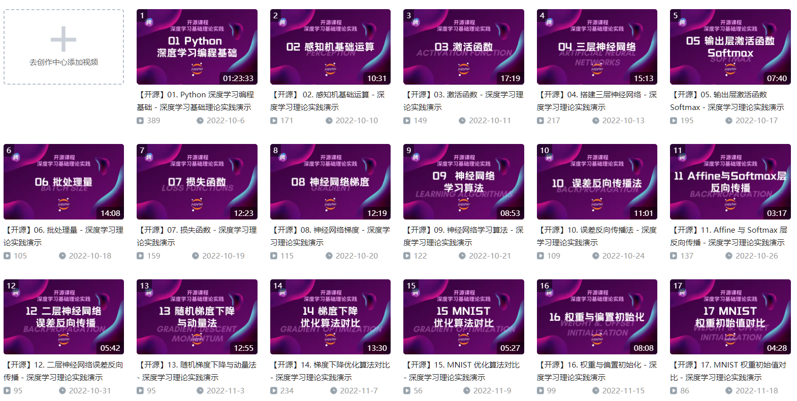

深度学习作为下一代人工智能的三大支柱之一（另外两个是大数据和云计算）是实现从自动驾驶到ChatGPT等大量机器学习和人工智能技术的关键理论组成部分。同时，在过去十年中，Python的创新也得到了极大的发展。你可以在统计、网站开发和面部识别中使用Python。除此之外，Python还被用于信息技术的开创性领域，如机器学习和数据科学。而这也使得Python成为深度学习实现的最实用工具之一。在这个资料库中，我只用Python来演示深度学习的基本原理，没有TensorFlow或PyTorch等第三方框架的帮助。这是你迈向深度学习的第一步。为了学习，我用中文写了这些笔记本和内联注解。而且我还会不断地更新这个页面，加入每个主题的相关注释。请以后继续查看。

你可以通过[这个链接](https://pan.baidu.com/s/1LFtqMtOZ4w2LeRfgFwm-fA?pwd=yek8)找到笔记本中的数据集，并在 Bilibili 上观看[讲解视频](https://space.bilibili.com/189064479/channel/collectiondetail?sid=763914)。

References:
- [CS231n Python Numpy Tutorial](https://cs231n.github.io/python-numpy-tutorial/)
- [NumPy Illustrated: The Visual Guide to NumPy](https://medium.com/better-programming/numpy-illustrated-the-visual-guide-to-numpy-3b1d4976de1d)
- [Dive into Deep Learning](https://d2l.ai/)
- [Deep Learning from Scratch](https://github.com/oreilly-japan/deep-learning-from-scratch)
